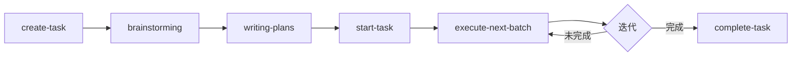

<!-- TASK-FLOW-TEMPLATE:FULL -->

## Task Flow 工作流

本项目采用 **task-flow v{VERSION}** 作为任务管理系统，结合 **superpowers** 技能体系提供结构化的开发流程。所有任务、状态、计划必须可追溯到 TASK-xxx。

### 核心原则

1. **事实源唯一**：任务与状态仅存在于 `docs/tasks/`
2. **计划归档唯一**：实施计划仅存在于 `docs/plans/`
3. **入口语句固定**：仅使用标准入口语句触发流程
4. **复杂任务强流程**：brainstorm → plan → execute
5. **强可追溯**：任务、计划、实现必须相互映射

### 快速开始

#### 最简流程

```bash
# 1. 创建任务
创建任务：实现用户认证

# 2. 启动任务（自动创建 worktree）
启动任务 TASK-001

# 3. 实现功能...

# 4. 完成任务（自动归档）
完成任务 TASK-001
```

#### 完整流程

```bash
# 1. 创建任务
创建任务：实现用户认证系统

# 2. 需求澄清
开始需求澄清：TASK-001

# 3. 编写实施计划
为 TASK-001 写实施计划

# 4. 启动任务
启动任务 TASK-001

# 5. 按计划批量执行
按计划执行 TASK-001

# 6. 更新进度
更新任务 TASK-001 进度到第 3 步

# 7. 完成任务
完成任务 TASK-001
```

### 标准入口语句

#### 任务管理

| 用户语句 | 触发命令 | 说明 |
|---------|---------|------|
| 创建任务：实现用户认证 | `create-task` | 生成新任务 ID 和模板 |
| 新建任务：添加登录功能 | `create-task` | 同上（别名） |
| 启动任务 TASK-001 | `start-task` | 创建 worktree 并更新状态 |
| 更新任务 TASK-001 进度到第 3 步 | `update-task --step 3` | 更新当前步骤 |
| 添加备注到 TASK-001 | `update-task --note "xxx"` | 添加备注信息 |
| 完成任务 TASK-001 | `complete-task` | 标记完成并归档 |
| 查看任务 TASK-001 | `show-task` | 显示任务详情 |
| 列出所有任务 | `list-tasks` | 显示任务列表 |

#### 计划执行

| 用户语句 | 触发命令 | 说明 |
|---------|---------|------|
| 按计划执行 TASK-001 | `execute-next-batch` | 执行下一批可执行任务 |
| 执行下一批 TASK-001 | `execute-next-batch` | 同上 |
| 执行计划 TASK-001 | `execute-plan` | execute-next-batch 别名 |

#### 流程协作

| 用户语句 | 触发技能 | 说明 |
|---------|---------|------|
| 开始需求澄清：TASK-001 | superpowers:brainstorming | 深入理解需求和约束 |
| 为 TASK-001 写实施计划 | superpowers:writing-plans | 生成可执行计划文档 |
| 审查 TASK-001 的实现 | superpowers:requesting-code-review | 代码质量检查 |

### 推荐执行流程

#### 主流程（复杂功能）



**详细步骤**：

1. **创建任务** → `create-task "标题"`
   - 生成任务 ID（TASK-XXX）
   - 创建包含 Plan Packet 的任务文件
   - 初始化任务状态为 Pending

2. **需求澄清** → superpowers:brainstorming
   - 明确目标和非目标
   - 识别约束和风险
   - 定义验收标准

3. **实施计划** → superpowers:writing-plans
   - 生成 YAML/Markdown 格式计划文件
   - 定义任务依赖关系
   - 设置执行顺序

4. **启动任务** → `start-task TASK-XXX`
   - 从 frontmatter 读取分支名
   - 创建或切换到 git worktree
   - 更新状态为 In Progress

5. **执行计划** → `execute-next-batch TASK-XXX`
   - 执行引擎自动解析依赖
   - 按批次执行可执行任务
   - 使用 set 追踪执行状态

6. **更新进度** → `update-task TASK-XXX --step N`
   - 单次更新 frontmatter
   - O(1) 任务索引查找

7. **完成任务** → `complete-task TASK-XXX`
   - 标记状态为 Done
   - 归档到 `docs/tasks/completed/`

#### 简化流程（小改动）

```bash
创建任务 → 启动任务 → 直接实现 → 完成任务
```

适用于：
- 单文件修改
- 简单 bug 修复
- 文档更新

### Task Flow v{VERSION} 新特性

#### 性能优化

| 特性 | 说明 | 性能提升 |
|------|------|----------|
| 任务索引 | O(1) 查找替代线性搜索 | 10x+ |
| frontmatter 单次更新 | 批量更新替代多次写入 | 3x+ |
| set 状态跟踪 | ExecutionEngine 使用 set 替代 list | 内存优化 |

#### 新增功能

1. **自动模板集成**：首次使用时自动初始化 CLAUDE.md
2. **Markdown 计划文件**：原生支持 Markdown 格式计划
3. **CI 命令自动检测**：自动识别 CI/CD 环境
4. **TodoWrite 兼容**：完全兼容 TodoWrite JSON 格式
5. **frontmatter branch 读取**：start-task 自动从 frontmatter 读取分支名

### 计划文件格式

#### YAML 格式

```yaml
# docs/plans/TASK-001-plan.yaml
tasks:
  - id: TASK-001-01
    title: "创建数据库模型"
    description: "设计并实现用户认证相关的数据库表结构"
    dependencies: []

  - id: TASK-001-02
    title: "实现认证 API"
    description: "创建登录、注册、登出接口"
    dependencies:
      - TASK-001-01

  - id: TASK-001-03
    title: "编写测试"
    description: "为认证功能添加单元测试和集成测试"
    dependencies:
      - TASK-001-02
```

#### Markdown 格式

```markdown
# TASK-001 实施计划

## Task 1: 创建数据库模型

**描述**: 设计并实现用户认证相关的数据库表结构
**依赖**: 无

## Task 2: 实现认证 API

**描述**: 创建登录、注册、登出接口
**依赖**: Task 1

## Task 3: 编写测试

**描述**: 为认证功能添加单元测试和集成测试
**依赖**: Task 2
```

### Plan Packet 结构

每个任务文件包含以下 9 个结构化 sections：

1. **Goal / Non-goals** - 明确目标和非目标
2. **Scope** - 按可并行 workstreams 拆分
3. **Interfaces & Constraints** - 接口与约束
4. **Execution Order** - 执行顺序
5. **Acceptance Criteria** - 验收标准
6. **Quality Gates** - 质量检查命令
7. **Risks & Rollback** - 风险与回滚
8. **Backlog 任务映射** - 任务 ID、文件路径、关联分支
9. **Notes** - 备注和上下文

### 相关技能

| 技能 | 用途 | 使用场景 |
|------|------|----------|
| **task-flow** | 任务管理核心 | 所有任务的创建、更新、完成 |
| **superpowers:brainstorming** | 需求澄清 | 复杂功能的需求分析 |
| **superpowers:writing-plans** | 计划编写 | 生成可执行的实施计划 |
| **superpowers:executing-plans** | 计划执行 | 按计划执行任务 |
| **superpowers:subagent-driven-development** | 子代理开发 | 分步执行复杂实现 |
| **superpowers:requesting-code-review** | 代码审查 | 实现完成后的质量检查 |

### 技术架构

```
~/.claude/skills/task-flow/
├── SKILL.md                      # 技能定义文件
├── README.md                     # 用户文档
├── requirements.txt              # Python 依赖
├── src/
│   ├── __init__.py
│   ├── __main__.py              # Python 模块支持
│   ├── cli.py                   # CLI 入口（450+ 行）
│   ├── task_manager.py          # 核心逻辑（350+ 行）
│   ├── ci_detector.py           # CI 命令检测
│   ├── execution_engine.py      # 执行引擎
│   ├── plan_generator/          # 计划类型定义
│   ├── config/                  # 配置管理模块（v{VERSION} 新增）
│   │   ├── manager.py           # ProjectConfigManager
│   │   ├── template_loader.py   # TemplateLoader
│   │   ├── content_merger.py    # ContentMerger
│   │   └── template_renderer.py # TemplateRenderer
│   └── todowrite_compat/        # TodoWrite 兼容层
├── templates/                   # 模板目录（v{VERSION} 新增）
│   ├── minimal.md               # 最小化模板
│   ├── standard.md              # 标准模板
│   ├── full.md                  # 完整模板
│   └── section_template.md      # 章节嵌入模板
└── tests/                       # 测试套件
    ├── test_config_manager.py   # 配置管理器测试
    ├── test_template_loader.py  # 模板加载器测试
    ├── test_content_merger.py   # 内容合并器测试
    └── test_integration.py      # 集成测试
```

**依赖要求**：
- Python 3.10+
- pytest（开发时）
- PyYAML

### 最佳实践

#### 1. 任务命名

**推荐**：
- 创建任务：实现用户认证
- 创建任务：修复登录超时问题
- 创建任务：优化数据库查询性能

**避免**：
- 创建任务：修复bug
- 创建任务：改东西
- 创建任务：优化

#### 2. 计划编写

**推荐**：
- 使用 Markdown 格式（更易读）
- 每个任务独立可测试
- 明确任务依赖关系

**避免**：
- 过度复杂的任务拆分
- 循环依赖
- 缺少验收标准

#### 3. 工作流选择

| 场景 | 推荐流程 |
|------|----------|
| 新功能开发 | 完整流程（brainstorm → plan → execute） |
| Bug 修复 | 简化流程（create → start → fix → complete） |
| 文档更新 | 简化流程 |
| 重构 | 完整流程 |

### 常见问题

**Q: 与 Backlog.md 的区别？**

A: Task Flow 使用纯文件系统，不依赖 MCP 服务器，更稳定可靠。

**Q: 如何备份任务？**

A: 所有任务文件都是 Markdown，Git 自动版本控制。

**Q: 支持多用户协作吗？**

A: 当前单用户设计，任务文件可通过 Git 协作。

**Q: execute-next-batch 如何工作？**

A: 在任务文件中设置 `execution_mode: "executing-plans"` 和 `plan_file` 路径。

**Q: 如何回滚已完成任务？**

A: 从 `docs/tasks/completed/` 手动恢复任务文件，更新状态。

**Q: 如何使用 task-flow init？**

A: 运行 `task-flow init` 初始化项目配置，或首次使用任何命令时自动提示。

> 由 task-flow v{VERSION} 自动生成 | {DATE}
