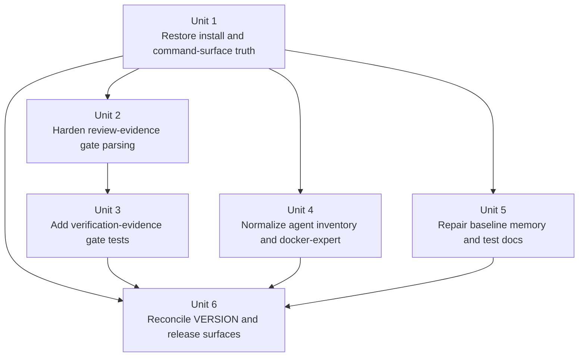

# fix: Restore baseline distribution integrity

## Overview

This plan repairs the highest-value correctness and trust issues surfaced by the full-project audit across the baseline distribution chain. The work is intentionally split into three delivery batches: first restore installer and gate correctness, then close coverage and definition drift in distribution assets, then reconcile versioning and release documentation so the published surface matches reality.

The goal is not to redesign the baseline architecture. The goal is to make the current distribution surface installable, review-gated, test-backed, and factually self-consistent for adopters and maintainers using Claude Code.

## Problem Frame

The audit found four cross-cutting problems that materially reduce confidence in this repo as a source-of-truth baseline:

1. The documented install path for `global/` assets is brittle or broken because copy commands do not reliably communicate recursive directory copying.
2. One TaskCompleted review gate can accept empty `Reviewer` / `Reference` fields, and the front matter parser is fragile around common file endings.
3. Distribution assets are only partially covered by automated tests, and some agent / command metadata disagrees with implementation reality.
4. Version, release, and reference documents have drifted from the current repo surface, including stale versions, missing directories, and misleading descriptions.

Because this repo is a baseline source and distribution source, these issues compound: inaccurate docs lead to broken installs, broken installs weaken runtime guarantees, and stale release surfaces erode maintainer trust.

## Requirements Trace

- R1. Restore a correct, portable, and fully documented installation path for `global/`, `distribution/commands/`, and `distribution/scripts/`.
- R2. Ensure review-gated completion cannot pass with empty or placeholder review evidence.
- R3. Make front matter and review artifact parsing robust against common file formatting variants.
- R4. Ensure all three TaskCompleted gates have automated test coverage appropriate to their responsibilities.
- R5. Reconcile agent inventory, agent definitions, and command metadata with actual repo behavior.
- R6. Repair baseline-memory and reference links so distributed artifacts only point at valid, reachable surfaces.
- R7. Reconcile `VERSION`, release notes, bootstrap docs, and repo READMEs so the published surface matches current reality.
- R8. Keep all changes inside existing baseline boundaries — no new control plane, no new runtime behavior layer, no automatic hook installation.

## Scope Boundaries

- No redesign of the three-layer architecture (`global/`, `distribution/`, `baseline/`).
- No new hook families, no new slash commands, and no new agent-routing model.
- No expansion of `global/standards/core-standard.md` beyond issue-driven consistency fixes already in flight.
- No attempt to introduce CI, release automation, or auto-sync flows in this pass.
- No changes to adopter-visible product behavior beyond fixing broken installs, broken gates, or incorrect documentation.

### Deferred to Separate Tasks

- Further `core-standard.md` structural slimming or global runtime policy redesign — separate planning/implementation thread.
- Any new distribution packaging strategy (for example `rsync`, archive packaging, or installer automation) — separate design task.
- Any broader agent-catalog redesign beyond aligning `docker-expert` and inventory truthfulness — separate task.

## Context & Research

### Relevant Code and Patterns

- `distribution/scripts/init-claude-workflow.sh` is the authoritative baseline installer for repo-local assets and already has contract tests in `tests/test_distribution_contract.py`.
- `distribution/hooks/project/taskcompleted-authoritative-state-gate/hook.mjs` and `distribution/hooks/project/taskcompleted-review-evidence-gate/hook.mjs` define the existing Node.js hook-testing pattern used by `tests/*.test.mjs`.
- `distribution/hooks/project/*/manual-test.md` provides the manual verification pattern for hook behavior and should stay aligned with any hook semantics changes.
- `distribution/agents/README.md` defines the two-tier routing contract and inventory table that individual agent files must honor.
- `global/README.md`, `README.md`, and `docs/claude-one-command-bootstrap.md` together define the adopter installation story and must stay mutually consistent.

### Institutional Learnings

- `docs/reference/superpowers-boundary.md` explicitly forbids turning this repo into a competing behavior-control layer; fixes must stay passive, portable, and opt-in.
- `docs/reference/hooks-scope.md` forbids automatic hook installation and requires user/project/local scope separation.
- `docs/reference/memory-boundary.md` forbids turning baseline memory into protocol storage or source-repo-only knowledge; distributed memory files must point to valid durable references.
- `baseline/docs/workflow/execution-contract.md` requires one authoritative state surface and disfavors hidden re-scoping; the remediation should land as bounded units, not an open-ended cleanup campaign.

### External References

- None required. The work is repo-internal and governed by this repo’s own distribution contracts and boundary documents.

## Key Technical Decisions

- Keep the remediation in three batches, but implement them as dependency-ordered implementation units rather than one giant cleanup PR. This preserves reviewability and rollback.
- Fix incorrect command/document surfaces by changing documentation and metadata to match implemented behavior, rather than introducing new behavior just to satisfy stale docs.
- Treat `tests/test_distribution_contract.py` and existing `node --test` hook suites as the authoritative regression harness. Expand them where there are clear gaps instead of inventing a new verification surface.
- Keep `docker-expert` aligned with the existing agent protocol used by `distribution/agents/README.md`; remove fictional coordination patterns instead of building infrastructure to support them.
- Treat release docs and `VERSION` as historical/public truth surfaces. If they are stale, fix the documents rather than relying on readers to infer current state from git history.

## Open Questions

### Resolved During Planning

- Should unimplemented `/init-claude-workflow` flags be built or removed? **Resolution:** remove unsupported flags and any patch-generation wording from adopter-facing docs unless implementation support lands in the same unit; this plan optimizes for truthful surfaces over feature expansion.
- Should the install command fix standardize on recursive no-clobber copy semantics? **Resolution:** yes. The documentation should converge on one recursive, non-destructive `global/* -> ~/.claude/` copy story; implementation may choose the final shell spelling, but it must preserve recursive directory copy plus no-clobber semantics everywhere.
- Should the plan include a broader `core-standard.md` redesign? **Resolution:** no. Only issue-driven consistency work already underway belongs here.
- Should release-note cleanup introduce a new release process? **Resolution:** no. This plan fixes factual drift only.
- Should `global/skills/` remain part of the distributed surface? **Resolution:** no. Remove the undocumented empty directory rather than inventing a new public surface for it.
- Should Batch 1 be shippable on its own? **Resolution:** yes. If no later batch lands, Batch 1 must still leave the repo with a correct install story, a hardened review-evidence gate, and no contradictory adopter-facing command/install guidance.

### Deferred to Implementation

- Whether `docker-expert` should keep `Bash` access. This may be a valid capability choice, but it should only change if the implementation review finds it unnecessary relative to the agent’s role.
- Whether stale historical release notes should be amended in place or supplemented with a clearly marked current release note. This depends on how much historical wording can be preserved without confusion.

## High-Level Technical Design

> *This illustrates the intended approach and is directional guidance for review, not implementation specification. The implementing agent should treat it as context, not code to reproduce.*

### Batch dependency graph

**Batching note:** These batches are delivery priorities, not artificial hard gates. A unit may begin as soon as its declared dependencies are satisfied, but a batch should not be considered complete until its exit criteria are met.

### Batch intent table

| Batch | Primary objective | Why it lands first / later |
|---|---|---|
| Batch 1 | Repair install contract and review-gate correctness | These are the highest-blast-radius defects; later docs and release cleanup should describe a correct baseline surface |
| Batch 2 | Close test and asset-definition drift | Once the install and gate contract is correct, strengthen coverage and normalize distribution artifacts |
| Batch 3 | Reconcile historical and release-facing truth surfaces | Last, so docs and version metadata describe the actual post-fix repo state |

## Implementation Units

- [ ] **Unit 1: Restore install-contract and command-surface truth**

**Goal:** Make the documented install path for `global/`, slash commands, and scripts correct and internally consistent.

**Requirements:** R1, R5, R7, R8

**Dependencies:** None

**Files:**
- Modify: `README.md`
- Modify: `docs/claude-one-command-bootstrap.md`
- Modify: `global/README.md`
- Modify: `distribution/commands/init-claude-workflow.md`
- Modify: `distribution/commands/new-feature.md`
- Modify: `tests/test_distribution_contract.py`

**Approach:**
- Make `README.md`, `docs/claude-one-command-bootstrap.md`, and `global/README.md` describe the same recursive, no-clobber installation semantics for `global/* -> ~/.claude/`, with the bootstrap doc explicitly fixed to stop implying a non-recursive copy.
- Reconcile `/init-claude-workflow` command metadata with the actual shell script behavior. Remove unsupported `argument-hint` flags and any implication that the script generates patch artifacts unless that support is implemented in the same unit.
- Keep the docs explicit that `global/` is a thin runtime surface, while `distribution/commands/` and `distribution/scripts/` remain separately installed assets.
- Add or extend contract coverage so the install-facing docs and command metadata can be regression-checked rather than relying only on manual review.

**Patterns to follow:**
- `tests/test_distribution_contract.py` for contract-level verification of documented install behavior.
- `README.md` directory-structure and “How distribution works” sections as the single repo-wide installation narrative.

**Test scenarios:**
- Happy path: documented install flow results in `docs/specs/_template/spec.md`, `docs/workflow/review-protocol.md`, `memory/MEMORY.md`, and `.claude/workflow-baseline-version` being created in a fresh git repo.
- Happy path: command docs still reference `~/.claude/scripts/init-claude-workflow.sh` and `~/.claude/scripts/instantiate-feature.sh` consistently.
- Edge case: the bootstrap guide uses the same recursive, no-clobber `global/*` copy semantics as `README.md` and `global/README.md`.
- Edge case: recursive copy instructions cover directory surfaces (`global/standards/`, `global/guides/`, `global/rules/`) instead of only top-level files.
- Error path: no adopter-facing command doc still advertises unsupported flags or patch-generation behavior the script does not implement.
- Integration: root README, bootstrap guide, and `global/README.md` describe the same installation chain without contradictory copy semantics.

**Verification:**
- The distribution contract test suite passes, including any new assertions that pin install-facing doc semantics and command metadata to the implemented surface.
- A reviewer can trace one consistent install story across all three documentation surfaces without inferring missing steps.

- [ ] **Unit 2: Harden review-evidence gate parsing and empty-field enforcement**

**Goal:** Ensure review-required tasks cannot pass with empty review metadata and that common front matter formatting variants parse correctly.

**Requirements:** R2, R3, R8

**Dependencies:** None

**Files:**
- Modify: `distribution/hooks/project/taskcompleted-review-evidence-gate/hook.mjs`
- Modify: `distribution/hooks/project/taskcompleted-review-evidence-gate/manual-test.md`
- Modify: `distribution/hooks/project/taskcompleted-review-evidence-gate/README.md` *(if behavior wording changes)*
- Test: `tests/taskcompleted-review-evidence-gate.test.mjs`

**Approach:**
- Fix the current empty-field bypass so absent, blank, or whitespace-only `Reviewer` / `Reference` values are rejected as invalid review evidence rather than silently treated as acceptable non-placeholders.
- Relax front matter parsing so files ending at closing `---` still parse correctly even without a trailing newline.
- Keep the existing artifact-shape flexibility (YAML front matter / JSON / plain text fallback), but tighten the acceptance criteria for evidence quality.
- Update manual test guidance only where behavior expectations materially change.

**Execution note:** Start with failing hook tests that prove the current bypass and front-matter edge case before changing parser logic.

**Patterns to follow:**
- `distribution/hooks/project/taskcompleted-authoritative-state-gate/hook.mjs` and its tests for exit-code and stderr contract style.
- Existing test style in `tests/taskcompleted-review-evidence-gate.test.mjs`.

**Test scenarios:**
- Happy path: a review artifact with populated `Reviewer`, `Reference`, and acceptable outcome still passes.
- Edge case: `Reviewer:` with an empty value is rejected.
- Edge case: `Reference:` with an empty value is rejected.
- Edge case: an artifact with no `Reviewer` key at all is rejected.
- Edge case: an artifact with no `Reference` key at all is rejected.
- Edge case: front matter ending exactly at closing `---` without a trailing newline still parses and evaluates correctly.
- Error path: malformed or missing review artifact still blocks completion with a clear message.
- Integration: manual test guidance and automated tests describe the same pass/fail conditions.

**Verification:**
- The review-evidence gate test suite passes, including new regressions for empty-field and no-trailing-newline cases.
- Manual reviewers can no longer satisfy the gate with structurally present but blank review metadata.

- [ ] **Unit 3: Close TaskCompleted verification gate coverage and parser edge cases**

**Goal:** Bring `taskcompleted-verification-evidence-gate` up to the same automated-verification standard as the other TaskCompleted hooks.

**Requirements:** R4, R8

**Dependencies:** None

**Files:**
- Modify: `distribution/hooks/project/taskcompleted-verification-evidence-gate/hook.mjs` *(only if the regex or parser findings are accepted as bugs)*
- Create: `tests/taskcompleted-verification-evidence-gate.test.mjs`
- Modify: `distribution/hooks/project/taskcompleted-verification-evidence-gate/manual-test.md` *(if scenario coverage needs to align with the new tests)*

**Approach:**
- Add the missing automated Node.js test suite for the verification-evidence gate using the same harness pattern as the other two TaskCompleted gates.
- Start with characterization coverage that confirms which current behaviors are intentional contract and which are accidental loose matches before modifying the hook.
- Treat this hook as independently scoped from Unit 2’s front-matter work: it uses heading/record parsing rather than the review-evidence gate’s YAML front-matter parser, so parser fixes should only be ported if a real bug is confirmed here.
- Preserve the current environment-variable-driven configuration model rather than redesigning the hook interface.

**Execution note:** Characterize current behavior first so the new suite distinguishes intentional contract from incidental implementation.

**Patterns to follow:**
- `tests/taskcompleted-authoritative-state-gate.test.mjs`
- `tests/taskcompleted-review-evidence-gate.test.mjs`

**Test scenarios:**
- Happy path: evidence artifact with a matching target and complete evidence records passes.
- Edge case: multiple evidence sections or multiple records are handled according to the current contract.
- Edge case: placeholder markers in evidence content are rejected.
- Edge case: existing heading/record parsing behavior is characterized explicitly so future changes can distinguish intentional contract from accidental permissiveness.
- Error path: missing artifact configuration blocks with the documented error.
- Error path: empty or unmatched target mapping blocks or exits according to the documented contract.
- Integration: automated tests cover the same scenarios described in `manual-test.md`, and the plan explicitly notes that the other two TaskCompleted gates already have test suites while this unit closes the missing third one.

**Verification:**
- All three TaskCompleted hook suites exist and pass.
- The verification-evidence gate has explicit automated coverage for the edge conditions the audit identified.

- [ ] **Unit 4: Normalize agent inventory and `docker-expert` to the repo’s actual agent protocol**

**Goal:** Make agent documentation and the `docker-expert` definition truthful, protocol-consistent, and reviewable.

**Requirements:** R5, R8

**Dependencies:** Unit 1

**Files:**
- Modify: `distribution/agents/README.md`
- Modify: `distribution/agents/docker-expert.md`
- Modify: `README.md` *(if the root directory tree or agent list still omits `docker-expert`)*
- Modify: `tests/test_distribution_contract.py`

**Approach:**
- Reconcile the inventory table with the actual agent files and frontmatter values, including the `technical-writer` model mismatch.
- Rewrite `docker-expert.md` to match the same operational style used by the other distributed agents: clear role, bounded usage conditions, and the same return-protocol contract.
- Remove fictional or non-executable coordination patterns (for example “context manager” queries or JSON message buses) instead of preserving them as aspirational text.
- Preserve the two-tier routing model documented in `distribution/agents/README.md`.

**Patterns to follow:**
- `distribution/agents/technical-writer.md`
- `distribution/agents/product-manager.md`
- `distribution/agents/orchestrator-planner.md`
- `distribution/agents/README.md`

**Test scenarios:**
- Happy path: every distributed agent file appears in `distribution/agents/README.md` with matching frontmatter identity and model metadata.
- Edge case: inventory validation catches a drift like the current `technical-writer` model mismatch instead of relying on manual review.
- Edge case: `docker-expert.md` no longer contains fictional message-bus / context-manager protocol text once rewritten to the repo’s actual agent contract.
- Integration: root README and agent inventory stay aligned if they both describe the distributed agent set.

**Verification:**
- A lightweight contract check passes for agent inventory vs. distributed agent frontmatter.
- `docker-expert.md` no longer depends on nonexistent coordination infrastructure and now reads like a real distributed agent definition.
- [ ] **Unit 5: Repair distributed memory references and maintainer-facing test docs**

**Goal:** Remove broken or misleading links from distributed memory artifacts and make local test documentation describe the repo’s actual test surface.

**Requirements:** R6, R8

**Dependencies:** Unit 1

**Files:**
- Modify: `baseline/memory/MEMORY.md`
- Modify: `baseline/memory/patterns.md`
- Modify: `baseline/memory/gotchas.md` *(if any parallel reference cleanup is needed)*
- Modify: `tests/README.md`
- Test: `tests/test_distribution_contract.py`

**Approach:**
- Replace source-repo-only memory links with references that remain correct after `baseline/` is copied into a target repo, using the post-install surface established by Unit 1.
- Keep the memory files as skeletons; do not add substantive project content while repairing links.
- Update `tests/README.md` so it truthfully describes the committed test files and their role, explicitly removing the current false “untracked” claim. If Unit 3 has already landed in the same working branch, include the new verification-evidence test in the inventory; otherwise keep the README wording correct for both pre- and post-Unit-3 states.
- Use the distribution contract test to verify the memory skeleton is still copied to the expected target locations.

**Patterns to follow:**
- `docs/reference/memory-boundary.md` for what distributed memory should and should not contain.
- Existing minimalist style of `baseline/memory/*.md` skeleton files.

**Test scenarios:**
- Happy path: initialized repo still contains `memory/MEMORY.md` and related memory skeleton files in the expected locations.
- Edge case: distributed memory docs do not point at `baseline/...` source-only paths that disappear after installation.
- Edge case: `tests/README.md` no longer claims committed test files are untracked or uncommitted.
- Integration: test README matches the actual committed test surface and remains truthful whether or not Unit 3 has already landed in the same branch.

**Verification:**
- A fresh initialized repo contains memory skeleton files whose internal links are still meaningful in the target repo.
- Maintainers reading `tests/README.md` get an accurate description of what is committed and how it is used.

- [ ] **Unit 6: Reconcile version, release, and public truth surfaces**

**Goal:** Make `VERSION`, release notes, bootstrap docs, and release-facing references reflect the current repo state instead of stale historical assumptions.

**Requirements:** R7, R8

**Dependencies:** Units 1, 3, 4, 5

**Files:**
- Modify: `VERSION`
- Modify: `docs/claude-one-command-bootstrap.md`
- Modify: `docs/releases/v1.0.0-release-note.md`
- Modify: `docs/releases/v1.0.0-maintainer-note.md`
- Modify: `docs/reference/superpowers-boundary.md`
- Modify: `global/README.md` *(if release-surface cleanup changes the public description of distributed contents)*
- Delete: `global/skills/`
- Test: `tests/test_distribution_contract.py`

**Approach:**
- Repair duplicated or placeholder version-history entries so `VERSION` is a credible source of current release truth, either by differentiating duplicated entries with real history or collapsing them into the latest accurate entry when they describe the same change set.
- Update the bootstrap guide’s visible version/date to match the current baseline release.
- Remove or replace stale release/reference claims that point to nonexistent directories such as `docs/audits/`, and correct outdated descriptions of current surfaces.
- Delete the undocumented empty `global/skills/` directory rather than promoting it into a new documented surface.
- Keep historical documents historical; only update what is necessary to prevent them from misleading current adopters and maintainers.

**Patterns to follow:**
- `README.md` and `VERSION` as current-truth surfaces.
- `docs/reference/superpowers-boundary.md` and `docs/reference/hooks-scope.md` for public boundary descriptions.

**Test scenarios:**
- Happy path: `VERSION` still exposes a parseable `baseline-version:` field used by the init script.
- Edge case: current release docs do not reference nonexistent directories or obsolete runtime surfaces.
- Integration: bootstrap guide, root README, and `VERSION` all describe the same current release state.
- Integration: if `global/skills/` is retained, public docs explain it; if removed, no docs imply it is part of the distributed surface.

**Verification:**
- Maintainers can read `VERSION`, release notes, and bootstrap docs without encountering obvious contradictions.
- The init script still reads the current version marker format correctly.

## System-Wide Impact

- **Interaction graph:** The install story spans `README.md`, `docs/claude-one-command-bootstrap.md`, `global/README.md`, `distribution/commands/init-claude-workflow.md`, and `distribution/scripts/init-claude-workflow.sh`. Review-gate correctness spans `distribution/hooks/project/taskcompleted-review-evidence-gate/` and its tests. Public agent truth spans `distribution/agents/README.md`, `distribution/agents/*.md`, and release-facing docs.
- **Error propagation:** Broken install docs create silent runtime misconfiguration; hook parsing bugs create false PASS states; stale release docs create maintainer and adopter misreads that are not caught by code execution.
- **State lifecycle risks:** A half-complete batch can leave the repo in a worse “partly truthful” state, especially if docs are updated before tests or if inventory tables are updated before agent definitions.
- **API surface parity:** Command frontmatter, agent inventory, and release docs are public surfaces in practice and need the same change at the same time when implementation reality changes.
- **Integration coverage:** The Python distribution contract suite and all three Node.js hook suites are the key integration checks. Pure doc-only units still need cross-file truth checks.
- **Unchanged invariants:** This plan does not change the three-layer distribution model, opt-in hook model, or two-tier agent-routing strategy. It repairs existing surfaces so they actually uphold those invariants.

## Risks & Dependencies

| Risk | Mitigation |
|------|------------|
| Fixing docs without fixing underlying behavior (or vice versa) creates new trust gaps | Each unit is scoped so contract docs and underlying implementation/test changes land together |
| Hook parser tightening could reject currently accepted but valid review artifacts | Start with failing characterization tests for the identified bypasses and preserve flexible artifact formats |
| `docker-expert` cleanup could accidentally narrow legitimate agent capability | Limit this pass to removing fictional protocol text and aligning with existing agent conventions; defer any tool-surface reduction unless clearly justified |
| Version-history cleanup could rewrite historical context too aggressively | Treat historical release notes as historical; only change what is required to avoid present-day factual contradictions |
| Cross-file release/doc drift returns later | End with a single release-surface reconciliation unit and explicit verification against root README, bootstrap doc, and VERSION |

## Dependencies / Prerequisites

- Python environment capable of running `tests/test_distribution_contract.py`
- Node.js environment capable of running the existing and newly added `node --test` suites for TaskCompleted hooks
- Agreement that this remediation stays within current baseline boundaries and does not expand product scope

## Phased Delivery

### Batch 1 — Correctness-first repair
- Unit 1: Restore install-contract and command-surface truth
- Unit 2: Harden review-evidence gate parsing and empty-field enforcement

**Batch 1 exit criteria:**
- The adopter install story is internally consistent across `README.md`, `docs/claude-one-command-bootstrap.md`, `global/README.md`, and `distribution/commands/init-claude-workflow.md`.
- The review-evidence gate rejects absent or blank review metadata and correctly parses front matter without requiring a trailing newline after closing `---`.
- No adopter-facing command/install doc still advertises unsupported flags or patch-generation behavior the implementation does not provide.

### Batch 2 — Coverage and asset-definition alignment
- Unit 3: Close TaskCompleted verification gate coverage and parser edge cases
- Unit 4: Normalize agent inventory and `docker-expert`
- Unit 5: Repair distributed memory references and maintainer-facing test docs

### Batch 3 — Public truth reconciliation
- Unit 6: Reconcile version, release, and public truth surfaces

## Documentation / Operational Notes

- This work updates both adopter-facing and maintainer-facing docs. Reviewers should explicitly check for repo-relative path correctness in all edited markdown files.
- If Batch 1 changes the preferred installation command wording, the same wording should be reused everywhere instead of paraphrased in multiple docs.
- Shared mutable truth surfaces span multiple units: `README.md`, `global/README.md`, `docs/claude-one-command-bootstrap.md`, and `tests/test_distribution_contract.py`. When a later unit must revisit one of these files, keep the later edit narrowly additive and explicitly verify it against the earlier unit’s claims.
- Release-surface cleanup should avoid introducing new policy language that diverges from `docs/reference/superpowers-boundary.md` or `docs/reference/hooks-scope.md`.

## Sources & References

- Related code: `distribution/scripts/init-claude-workflow.sh`
- Related code: `distribution/hooks/project/taskcompleted-review-evidence-gate/hook.mjs`
- Related code: `distribution/hooks/project/taskcompleted-verification-evidence-gate/hook.mjs`
- Related code: `distribution/agents/README.md`
- Related code: `distribution/agents/docker-expert.md`
- Related code: `baseline/memory/MEMORY.md`
- Related code: `tests/test_distribution_contract.py`
- Related docs: `docs/reference/superpowers-boundary.md`
- Related docs: `docs/reference/hooks-scope.md`
- Related docs: `docs/reference/memory-boundary.md`
- Related release docs: `docs/releases/v1.0.0-release-note.md`, `docs/releases/v1.0.0-maintainer-note.md`
